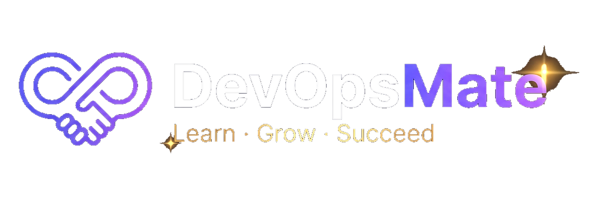

### 👨‍💼 About Me

# Hey Everyone 👋
I’m Balu, and I work as a DevOps engineer. I’m an experienced tech professional with a passion for teaching.
I created this Githun to share my knowledge and the things I learn along the way. 
My goal is to give you a clear, practical path toward AWS DevOps roles.

🎯Don’t try to learn everything at once, and don’t get stuck trying to cover it all. Focus on what truly matters so you build strong core knowledge and move closer to AWS DevOps jobs. That’s how I’ll try to teach you.

Whether you’re a fresher, switching careers, or just curious about DevOps on AWS, this channel is for you.

> *"Helping people learn DevOps with real-world projects. Let's build and automate the future, one pipeline at a time!"*
---

**Thanks for visiting DevOpsMate — Learn · Grow · Succeed**

---

👨‍💻 All of my projects are available at **https://github.com/devopsmate7**

💬 Ask me about **AWS, DevOps, EC2, Docker, Kubernetes, Terraform, CI/CD**

📫 How to reach me **devopsmate7@gmail.com**

🔔 Subscribe and start your real AWS DevOps journey today.

---

### Connect with me:

---

### Languages and Tools:

---

